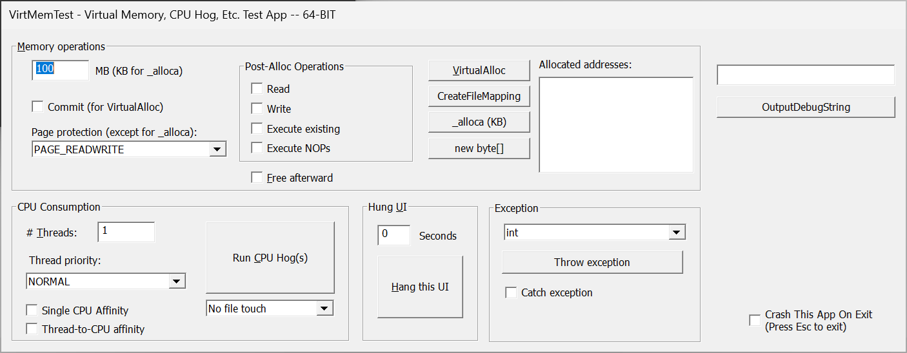

# VirtMemTest

I wrote the first versions of VirtMemTest while working on the first Sysinternals book. The tool made it easy for me to perform a variety of 
memory operations and to observe how different Sysinternals utilities reacted to them. I eventually added CPU-stress capabilities, hung UI simulation, 
and crash-on-exit, particularly for exercising ProcDump. I later used it in some of my technical presentations, and eventually posted
the first public version (with source code) back in 2013. In spite of its still-primitive UI and feature set (not to mention the total-trash throwaway quality
of the source code), I still find myself using it often to
invoke various scenarios, so I'm publishing this updated version.

## Memory Operations

The `VirtualAlloc`, `CreateFileMapping`, `_alloca` and `new byte[]` buttons perform memory allocation operations according to options you select 
in the rest of the Memory Options group box. `VirtualAlloc` is the one I use the most, and the operation for which most of the 
other options apply. `VirtualAlloc` simply calls the [VirtualAlloc](https://learn.microsoft.com/en-us/windows/win32/api/memoryapi/nf-memoryapi-virtualalloc) API; 
CreateFileMapping creates a named file mapping backed by the process' virtual memory; `_alloca` performs a stack allocation; and `new byte[]` uses the C++ “new” operator to allocate heap memory.

Set the amount of memory to allocate in the text box preceding “MB”. Note that this is a simple app so there’s no overflow detection in the 
32-bit version if you exceed what can be represented in 32 bits. E.g., if you specify 5000 MB, it will multiply 5000 * 1024 * 1024, which 
overflows a 32-bit unsigned long and retains only the lower 32 bits (904 MB). Also note that in spite of the “MB” label, `_alloca` 
allocates KB instead of MB.

With `VirtualAlloc`, memory is reserved but not committed unless you select the “Commit” option. Select the desired page protection for the 
new allocation with the Page Protection dropdown.

If you check “Free afterward”, VirtMemTest will display a message box after allocating the memory, and free the memory when you click OK. 
Otherwise it will simply leak the memory.

### Post-Alloc Operations

The "Read," "Write," "Execute existing," and "Execute NOPs" checkboxes perform the corresponding operations on the allocated memory after it has been allocated. 
This is an interesting way to observe what happens when you try to read from uncommitted memory or to write to read-only memory; you can test 
Data Execution Protection (DEP) by executing memory that has or has not been marked for execution. 
"Read" tries to read whatever is in that memory; "Write" tries to write arbitrary data to the allocated memory; "Execute existing" tries to execute
whatever is present in that memory after allocation (quite probably random garbage, so likely to crash with or without DEP); "Execute NOPs" will fill the allocation with "no operation" 
CPU instructions followed by a "return" operation (temporarily changing page protection to allow these bytes to be written there).

Allocated Addresses lists the starting addresses for the allocated memory blocks.

## CPU Consumption

When you click the “Run CPU Hog(s)” toggle button, VirtMemTest spins up one or more CPU-bound threads that run at the priority you specify in the Thread Priority dropdown until you toggle the CPU Hog(s) button back off. If you select “Single CPU Affinity”, all the threads will be scheduled only on CPU 0. (This obviously has no effect on single-CPU systems.)

I recently added the “file touch” dropdown for demo purposes to show how to integrate Process Monitor and ProcDump by injecting ProcDump output into Procmon’s event list. If you select “One-time file touch”, VirtMemTest will try to open “C:\VirtMemTest.log” right before going CPU-bound. If you select “Repeated file touch”, it also tries to open C:\VirtMemTest.log inside the CPU-bound loop.

## Hung UI

Specify the number of seconds you want VirtMemTest to be non-responsive to UI events, then click “Hang this UI”.

## Exception

text

## OutputDebugString

text

## Crash This App

Press Esc to exit the app. If the “Crash This App” option is selected, VirtMemTest will try to write to address 0 right before exit.

So:  Go have fun!  (According to some turbogeek definition of fun.)

